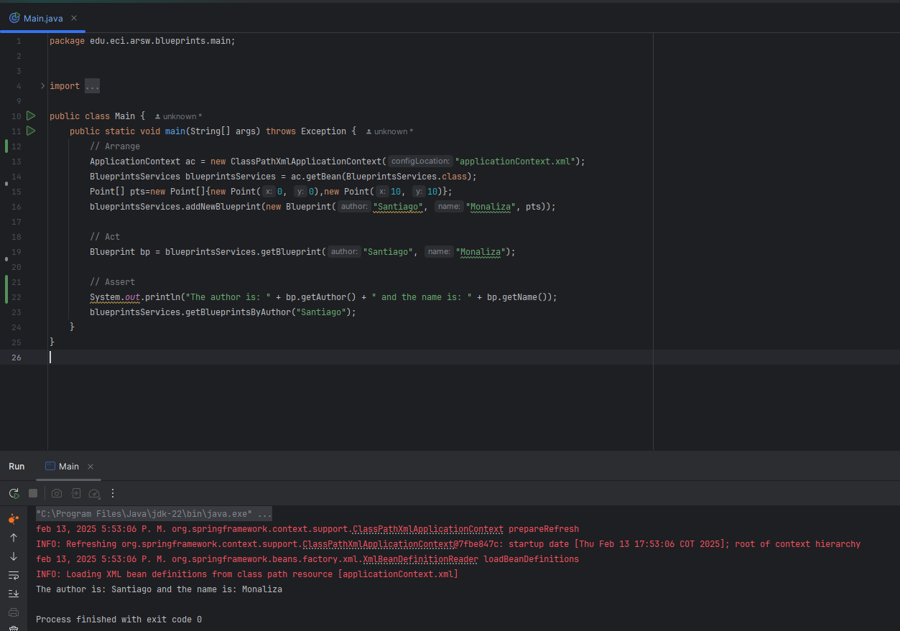
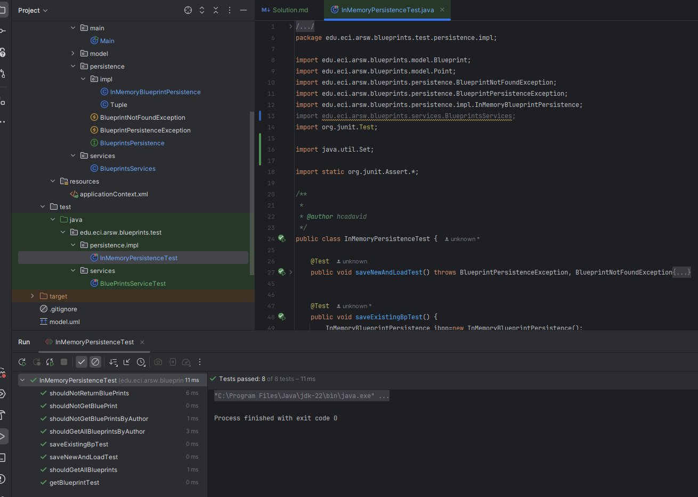

# Resolución Laboratorio 4

## Tabla de Contenido
1. [Integrantes](#integrantes)
2. [Introducción](#introducción)
3. [Procedimiento](#procedimiento)
    1. [Introducción Anotaciones Springboot](#Introducción-Anotaciones-Springboot) 
   2. [Parte I](#Parte-i)
4. [Conclusiones](#conclusiones)

---

## Integrantes
- Santiago Avellaneda
- Miguel Motta

---

## Introducción
En este laboratorio, se trabajó en la implementación de un sistema de gestión de planos utilizando el framework Spring para la inyección de dependencias. El objetivo principal fue configurar la aplicación para que funcione bajo un esquema de inyección de dependencias, implementar operaciones de consulta y registro de planos, y aplicar filtros para procesar los datos antes de retornarlos. Se exploraron conceptos clave de Spring, como la anotación @Autowired para la inyección de dependencias y la configuración de beans mediante archivos XML.

---

## Procedimiento

---
### Introducción Anotaciones Springboot
> Este punto se adjuntó en otro repositorio, el cual se encuentra en el siguiente enlace [Introducción Anotaciones Springboot](https://github.com/MIGUEL-MOTTA-U/ARSW-4-Annotations)

### Parte I
> #### 1. Configure la aplicación para que funcione bajo un esquema de inyección de dependencias, tal como se muestra en el diagrama anterior.
>
> Lo anterior requiere:
>
> * Agregar las dependencias de Spring.
> * Agregar la configuración de Spring.
> * Configurar la aplicación -mediante anotaciones- para que el esquema de persistencia sea inyectado al momento de ser creado el bean 'BlueprintServices'.
> #### 2. Complete las operaciones getBluePrint() y getBlueprintsByAuthor(). Implemente todo lo requerido de las capas inferiores (por ahora, el esquema de persistencia disponible `InMemoryBlueprintPersistence`) agregando las pruebas correspondientes en `InMemoryPersistenceTest`.
> 
> #### 3. Haga un programa en el que cree (mediante Spring) una instancia de BlueprintServices, y rectifique la funcionalidad del mismo: registrar planos, consultar planos, registrar planos específicos, etc.
>
> #### 4. Se quiere que las operaciones de consulta de planos realicen un proceso de filtrado, antes de retornar los planos consultados. Dichos filtros lo que buscan es reducir el tamaño de los planos, removiendo datos redundantes o simplemente submuestrando, antes de retornarlos. Ajuste la aplicación (agregando las abstracciones e implementaciones que considere) para que a la clase BlueprintServices se le inyecte uno de dos posibles 'filtros' (o eventuales futuros filtros). No se contempla el uso de más de uno a la vez:
>
> * (A) Filtrado de redundancias: suprime del plano los puntos consecutivos que sean repetidos.
> * (B) Filtrado de submuestreo: suprime 1 de cada 2 puntos del plano, de manera intercalada.
> #### 5. Agrege las pruebas correspondientes a cada uno de estos filtros, y pruebe su funcionamiento en el programa de prueba, comprobando que sólo cambiando la posición de las anotaciones -sin cambiar nada más-, el programa retorne los planos filtrados de la manera (A) o de la manera (B).
> 
### Solución
> ### Punto 1
> Para resolver este ejercicio, tuvimos que configurar la configuración de aplicación de Sprinboot,
> de modo que creamos un archivo en una carpeta de configuración llamado [`applicationContext.xml`](src/main/resources/applicationContext.xml) en el directorio `src/main/resources` y agregamos las siguientes líneas de código:
> ```xml
> <?xml version="1.0" encoding="UTF-8"?>
> <beans xmlns="http://www.springframework.org/schema/beans"
> xmlns:xsi="http://www.w3.org/2001/XMLSchema-instance"
> xmlns:context="http://www.springframework.org/schema/context"
>
>        xsi:schemaLocation="http://www.springframework.org/schema/beans http://www.springframework.org/schema/beans/spring-beans-4.2.xsd
>           http://www.springframework.org/schema/context http://www.springframework.org/schema/context/spring-context-4.2.xsd
> ">
>
>     <context:component-scan base-package="edu.eci.arsw" />
>
> </beans>
> ```
> Luego, en la clase [`BlueprintServices`](src/main/java/edu/eci/arsw/blueprint/services/BlueprintsServices.java) agregamos la anotación `@Service` para que Springboot pueda inyectar la dependencia de la clase 
> [`InMemoryBlueprintPersistence`](src/main/java/edu/eci/arsw/blueprint/persistence/impl/InMemoryBlueprintPersistence.java) en la clase `BlueprintServices`.:
> 
> 
> #### Clase [`BlueprintServices`](src/main/java/edu/eci/arsw/blueprint/services/BlueprintsServices.java)
> 
> ```java
> @Service
> public class BlueprintsServices {
>     BlueprintsPersistence bpp;
>     /* Especificamos que se inyecte la dependencia de la clase InMemoryBlueprintPersistence dado 
>     que es la única implementación de la interfaz BlueprintsPersistence */
>     @Autowired
>     public BlueprintsServices(BlueprintsPersistence bpp) {
>         this.bpp = bpp;
>     }
> }
> ```
> 
> #### Clase [`InMemoryBlueprintPersistence`](src/main/java/edu/eci/arsw/blueprint/persistence/impl/InMemoryBlueprintPersistence.java)
> ```java
> @Service
> public class InMemoryBlueprintPersistence implements BlueprintsPersistence {
> // ...
> }
> ```
> 
> De esta manera se le especifica que es un servicio y que se inyecte la dependencia de la clase `InMemoryBlueprintPersistence` en la clase `BlueprintServices`.
> 
> Ahora lo implementamos en una clase de Main para verificar que la inyección de dependencias funcione correctamente:
> ```java
> public class Main {
>     public static void main(String[] args) throws Exception {
>         // Arrange
>         ApplicationContext ac = new ClassPathXmlApplicationContext("applicationContext.xml");
>         BlueprintsServices blueprintsServices = ac.getBean(BlueprintsServices.class);
>         Point[] pts=new Point[]{new Point(0, 0),new Point(10, 10)};
>         blueprintsServices.addNewBlueprint(new Blueprint("Santiago", "Monaliza", pts));
> 
>         // Act
>         Blueprint bp = blueprintsServices.getBlueprint("Santiago", "Monaliza");
> 
>         // Assert
>         System.out.println("The author is: " + bp.getAuthor() + " and the name is: " + bp.getName());
>         blueprintsServices.getBlueprintsByAuthor("Santiago");
>     }
> }
> ```
> 
> *Verificamos el resultado de la ejecución:*
> 
> 
>
> Esto demuestra que la inyección de dependecias funciona correctamente.
> 

> ### Punto 2
> Para resolver este ejercicio, tuvimos que completar las operaciones `getBlueprint()` y `getBlueprintsByAuthor()` en la clase `InMemoryBlueprintPersistence` 
> y agregar las pruebas correspondientes en la clase [`InMemoryPersistenceTest`](src/test/java/edu/eci/arsw/blueprints/test/persistence/impl/InMemoryPersistenceTest.java)
> y [`BlueprintsServicesTest`](src/test/java/edu/eci/arsw/blueprints/test/services/BluePrintsServiceTest.java).
> 
> Luego verificamos que las operaciones `getBlueprint()` y `getBlueprintsByAuthor()` funcionen correctamente ejecutando las pruebas al hacer la implementación:
> 
> 
> 
> 

> ### Punto 3
> Para resolver este ejercicio creamos en la clase main diferentes metodos para probar la funcionalidad de la clase `BlueprintServices`:
> Se puede verificar su funcionamiento en la clase [`Main`](src/main/java/edu/eci/arsw/blueprint/Main.java)

> ### Punto 4
> Para resolver esto primero creamos la interfaz `BlueprintsFilter` en el paquete `edu.eci.arsw.blueprints.filter` y luego creamos las clases `RedundancyFilter` y `SubsamplingFilter` que implementan la interfaz `BlueprintsFilter`.
> La clase [`RedundancyFilter`](src/main/java/edu/eci/arsw/blueprint/services/impl/RedundancyFilter.java) se encarga de eliminar los puntos consecutivos que sean repetidos. 
> Mientras que la clase [`SubsamplingFilter`](src/main/java/edu/eci/arsw/blueprint/services/impl/SubsamplingFilter.java) se encarga de eliminar 1 de cada 2 puntos del plano, de manera intercalada.

> ### Punto 5
> La interfaz mencionada en el anterior punto se creo para poder más adelante poder hacer la inyección de dependencias en la clase `BlueprintServices` de uno de los dos filtros. 
> Después realizamos la inyección por constructor de las diferentes clases de filtro en la clase `BlueprintServices`:
> ```java
> @Service
> public class BlueprintsServices {
>
>    BlueprintsPersistence bpp;
>    private BlueprintFilter blueprintFilter;
>
>    @Autowired
>    public BlueprintsServices(BlueprintsPersistence bpp, @Qualifier("redundancyFilter") BlueprintFilter blueprintFilter) {
>        this.bpp = bpp;
>        this.blueprintFilter = blueprintFilter;
>    }
> // ...
> }
### Conclusiones
Conclusiones
1. Inyección de Dependencias: La configuración de la inyección de dependencias mediante Spring permite desacoplar las clases y facilita la gestión de las dependencias, mejorando la mantenibilidad y escalabilidad del código.
2. Configuración de Spring: La correcta configuración de Spring, tanto mediante anotaciones como mediante archivos XML, es crucial para el funcionamiento adecuado de la inyección de dependencias y la detección de beans.
3. Pruebas Unitarias: La importancia de las pruebas unitarias se evidenció al verificar la funcionalidad de las operaciones implementadas, asegurando que el sistema se comporte según lo esperado.
4. Flexibilidad y Extensibilidad: El uso de interfaces y la inyección de dependencias permiten que el sistema sea flexible y extensible, facilitando la adición de nuevas funcionalidades o la modificación de las existentes sin afectar el resto del sistema.