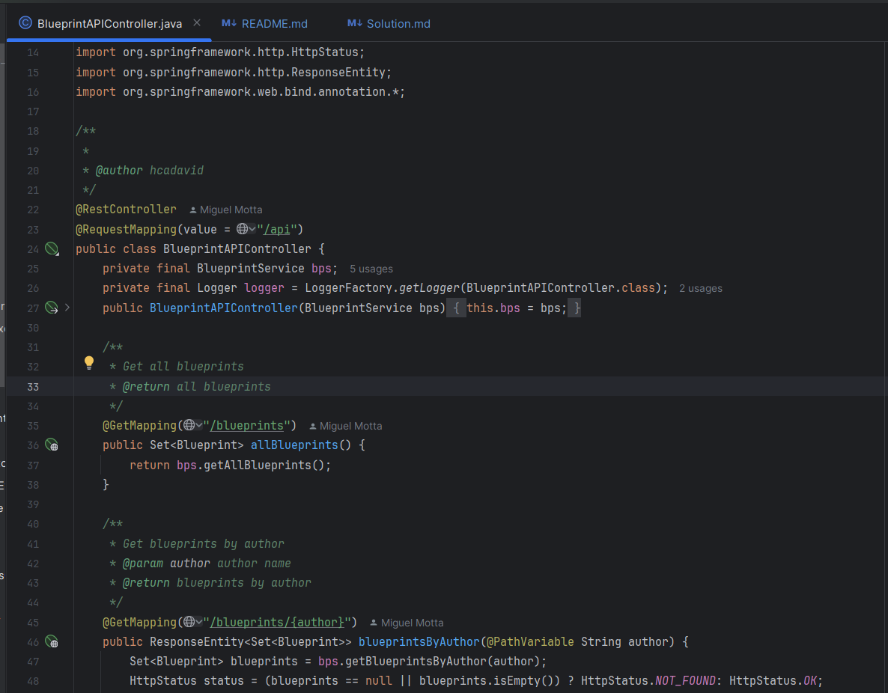
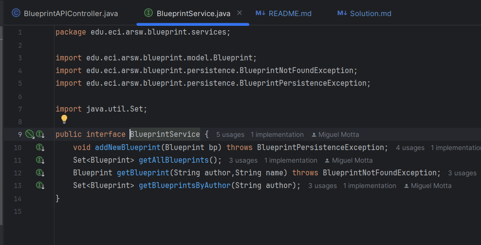
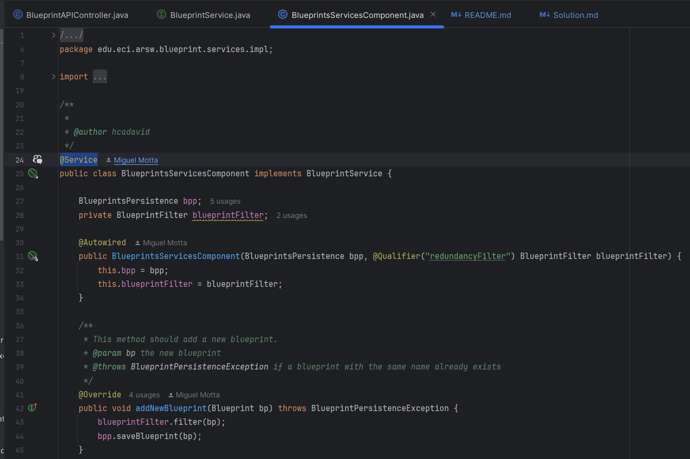
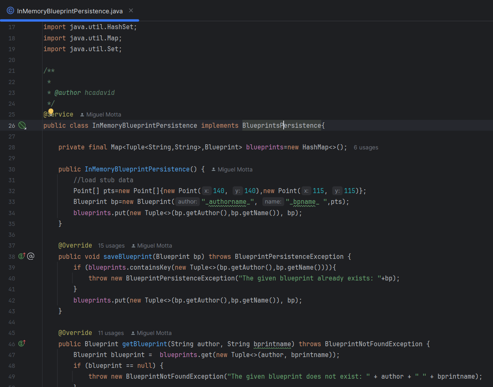
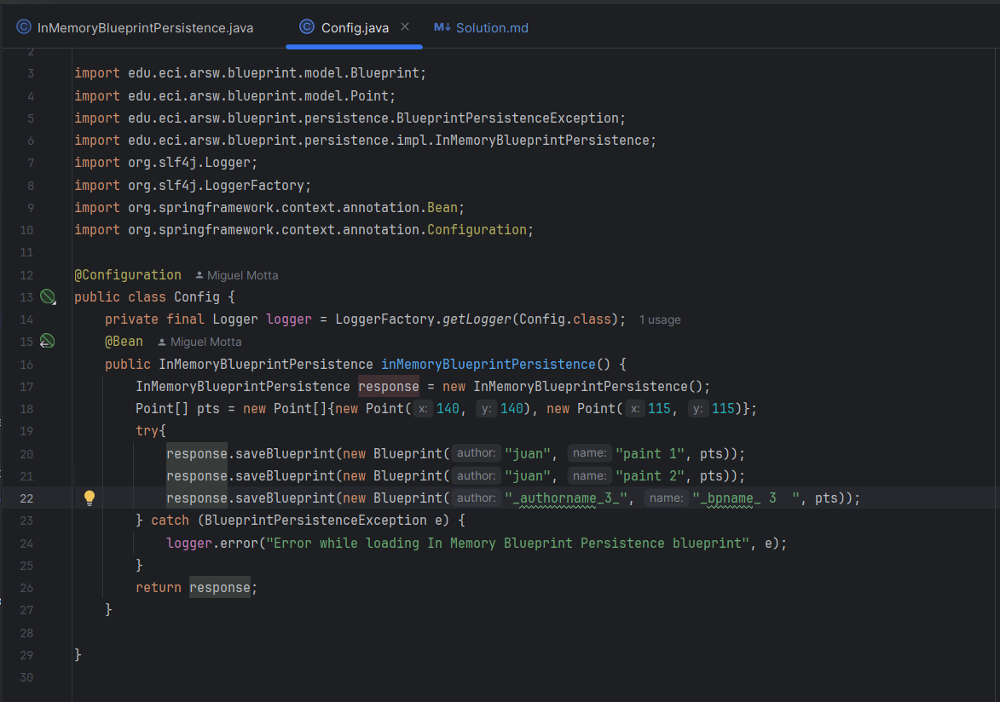
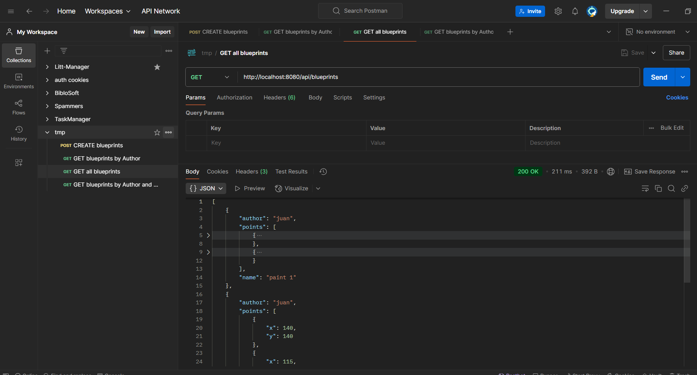
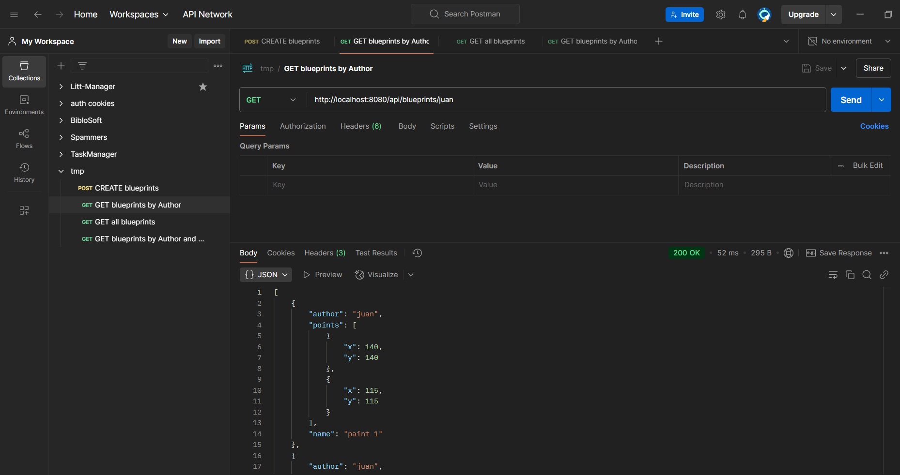
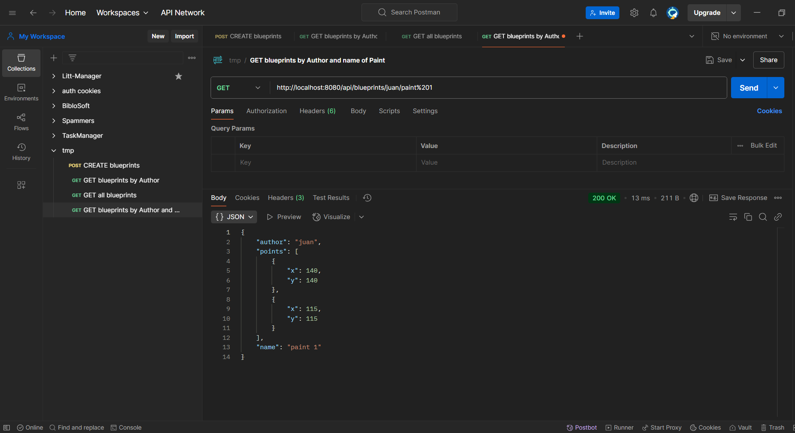
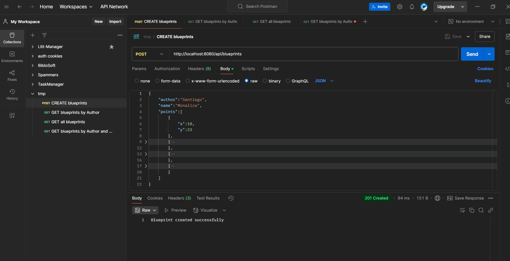

# Resolución Laboratorio 4

## Tabla de Contenido
1. [Integrantes](#integrantes)
2. [Introducción](#introducción)
3. [Procedimiento](#procedimiento)
   1. [Parte I](#Parte-i)
   2. [Parte II](#Parte-ii)
   3. [Parte III](#Parte-iii)
4. [Conclusiones](#conclusiones)

---

## Integrantes
- Santiago Avellaneda
- Miguel Motta

---

## Introducción
**Introducción**

El presente informe tiene como objetivo documentar el desarrollo de un componente 
de API REST denominado *BlueprintsRESTAPI*, diseñado para gestionar los planos 
arquitectónicos de una reconocida compañía de diseño. Este API, implementado 
sobre el marco de trabajo Spring, permite la manipulación centralizada de los 
planos mediante servicios estandarizados y desacoplados de la persistencia de 
datos. A través de este ejercicio, se busca construir una infraestructura sólida que 
permita ofrecer servicios HTTP seguros y eficientes, garantizando una correcta gestión 
y exposición de los recursos, y resolviendo problemas de concurrencia en un entorno 
de múltiples peticiones simultáneas.

---

## Procedimiento
### Parte I

##### Problema
> 1. Integre al proyecto base suministrado los Beans desarrollados en el ejercicio anterior.
> Solo copie las clases, NO los archivos de configuración. Rectifique que se tenga 
> correctamente configurado el esquema de inyección de dependencias con las anotaciones 
> [`@Service`](https://www.baeldung.com/spring-component-repository-service) y [`@Autowired`](https://www.baeldung.com/spring-autowire).
> 
> 2. Modifique el bean de persistencia 'InMemoryBlueprintPersistence' para que por defecto se inicialice con al menos 
> otros tres planos, y con dos asociados a un mismo autor.
> 
> 3. Configure su aplicación para que ofrezca el recurso `/blueprints`, de manera que cuando se le haga una 
> petición `GET`, retorne en formato `jSON` el conjunto de todos los planos
> 4. Verifique el funcionamiento de a aplicación lanzando la aplicación con maven
> 5. Modifique el controlador para que ahora, acepte peticiones `GET` al recurso `/blueprints/{author}`, 
> el cual retorne usando una representación jSON todos los planos realizados por el autor cuyo nombre 
> sea `{author}`. Si no existe dicho autor, se debe responder con el código de error `HTTP 404`.
> 6. Modifique el controlador para que ahora, acepte peticiones `GET` al recurso `/blueprints/{author}/{bpname}`, 
> el cual retorne usando una representación `jSON` solo UN plano, en este caso el realizado por `{author}` y 
> cuyo nombre sea `{bpname}`. De nuevo, si no existe dicho autor, se debe responder con el código de error 
> `HTTP 404`.

##### Solución
> Para resolver este ejercicio, implementamos las anotaciones de `@Service` y `@RestController` en la clase 
> [`BlueprintAPIController`](src/main/java/edu/eci/arsw/blueprint/controllers/BlueprintAPIController.java)
> de modo que con la anotación de `@Service` se pueda inyectar el bean de tipo `BlueprintServices` y con la
> anotación de `@RestController` se pueda exponer el recurso `/blueprints` para que cuando se haga una petición
> `GET` retorne el conjunto de todos los planos en formato JSON. Además, se modificó el bean de persistencia
> `InMemoryBlueprintPersistence` para que por defecto se inicialice con al menos otros tres planos, y con dos
> asociados a un mismo autor.
> ####  Clase [`BlueprintAPIController`](src/main/java/edu/eci/arsw/blueprint/controllers/BlueprintAPIController.java)
> Esta clase recibe una dependencia inyectada que es una clase que implementa el servicio ofrecido en la interfaz
> [`BlueprintServices`](src/main/java/edu/eci/arsw/blueprint/services/BlueprintService.java) y se encarga de
> exponer los servicios REST para la gestión de planos arquitectónicos.
> 
> 
> 
>
> #### Clase [`BlueprintServices`](src/main/java/edu/eci/arsw/blueprint/services/BlueprintService.java)
> Esta interfaz define los servicios que se ofrecen para la gestión de planos arquitectónicos.
> 
>
>
> #### Clase [`BlueprintServiceComponent`](src/main/java/edu/eci/arsw/blueprint/services/impl/BlueprintsServicesComponent.java)
> Esta clase implementa la interfaz `BlueprintServices` y se encarga de la lógica de negocio de los servicios
> ofrecidos para la gestión de planos arquitectónicos.
> 
> 
> 
> #### Clase [`InMemoryBlueprintPersistence`](src/main/java/edu/eci/arsw/blueprint/persistence/impl/InMemoryBlueprintPersistence.java)
> Esta clase implementa la interfaz `BlueprintPersistence` y se encarga de la persistencia de los planos arquitectónicos
> en memoria y es inyectada en la clase `BlueprintServiceComponent` usando la misma metodología que ofrecen las anotaciones de Spring.
> 
> 
> #### Clase [`Config`](src/main/java/edu/eci/arsw/blueprint/config/Config.java)
> Esta clase se encarga de la configuración de la aplicación y de la inyección de dependencias de los beans necesarios para el correcto
> funcionamiento de la aplicación. En esta clase se configura el bean de tipo `BlueprintPersistence` para que se inyecte en la clase
> `BlueprintServiceComponent` y se inicialice con al menos otros tres planos, y con dos asociados a un mismo autor (juan).
> 
> 
>
> #### Pruebas con Postman
> Para hacer las pruebas del controlador, usamos [`Postman`](https://www.postman.com/)
> #### Prueba con Get all blueprints
> 
>
> #### Prueba con Get blueprints por `author`
> 
>
> #### Prueba con Get blueprint por `author` y `name`
> 
>
>#### Prueba con Post para crear un Blueprint
> 
> 
### Parte II

### Parte III

## Conclusiones